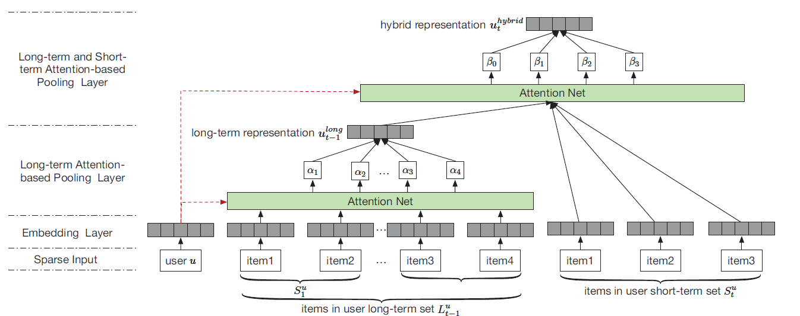

# Sequential Recommender System based on Hierarchical Attention Network
IJCAI 2018

## 论文内容
这篇论文是关于`用户行为序列`的推荐问题。之前的工作忽视了用户长期兴趣的演变，对用户的长期兴趣学一个静态的表达，不能充分反映用户长期兴趣的动态性。这篇论文使用`two-layer hierarchical attetnion network`来解决这个问题。第一层attention学习了用户的长期兴趣，第二层attention基于用户的长期兴趣和短期行为，学习一个最终的表达。

`用户行为序列`的推荐问题的挑战有：
* 用户行为是隐性的反馈，表示用户点击或者每点击，购买或者没购买。而不是显性的反馈，用户打分是多少。这样很难区分对于用户没有点击的item，用户是不喜欢还是没有看到。
* 用户的序列行为源于session和transaction，这个回影响到用户的短期偏好。例如，用户在下飞机之后，更偏向于休息而不是运动。

SHAN模型首先将用户行为做embedding，之后是第一层attention，使用user embedding来对用户长期行为序列做attention。之后是第二层attention，使用user embedding对长期行为的attention的结果和短期行为一起做attention。使用BPR优化方法进行参数学习。

### 问题定义
模型的输入是一个个的Session，在t时刻，之前的t-1个Session作为长期兴趣，最后一个Session作为短期兴趣。

模型结构如下图：

## 相关文献
这篇论文属于next-item推荐论文，